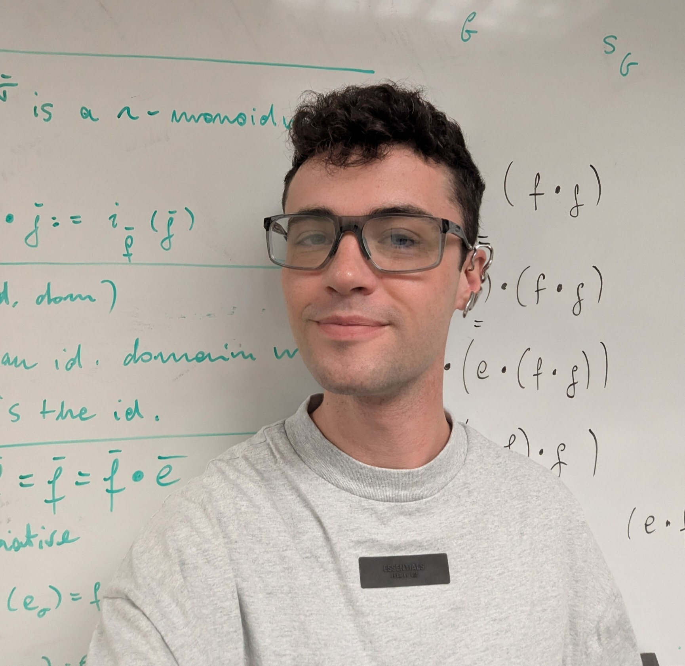

I'm a philosophy Ph.D. candidate at the [University of Southern California](https://dornsife.usc.edu/phil/), where I am advised primarily by [Andrew Bacon](https://andrew-bacon.github.io/). Before USC, I've done graduate work at the [Institute for Logic, Language and Computation](https://www.illc.uva.nl/) and at the [University of St Andrews](https://www.st-andrews.ac.uk/philosophy/). My undergraduate degree is from the [University of Padua](https://www.fisppa.unipd.it/).

I work primarily on topics in philosophical logic and metaphysics. The main project I'm working on explores the idea that [[Quantificationalism|propositions can be true or false at or relative to domains of quantification]], in much the same sense they can be [[Temporalism and Modalism|true or false at times or possible worlds]]. My broader philosophical interests include the philosophy of language, the philosophy of logic, decision theory, and formal ethics. 

I'm also active in mathematical logic. In recent work with [Nick Bezhanishvili](https://staff.fnwi.uva.nl/n.bezhanishvili/), we give a new [[proof of the Blok-Esakia theorem via stable canonical rules|new proof of the Blok-Esakia theorem]], which states that the lattice of superintuitionistic logics is isomorphic to that of normal extensions of the modal logic $\mathtt{Grz}$. Our proof leverages the machinery of [[Stable canonical rule|stable canonical rules]] and can be readily generalized to prove analogous results in richer signatures. 

As you've probably noticed, this website is sprinkled with internal links to pages about concepts, theses, arguments and results related to my work.  I'm hoping these pages can be useful to people who want to know a little more about what I do without having to read whole papers. (This functionality is a work in progress, so some links may not work yet.)

You can email me at: cleani[at]usc[dot]edu

  
  
  
