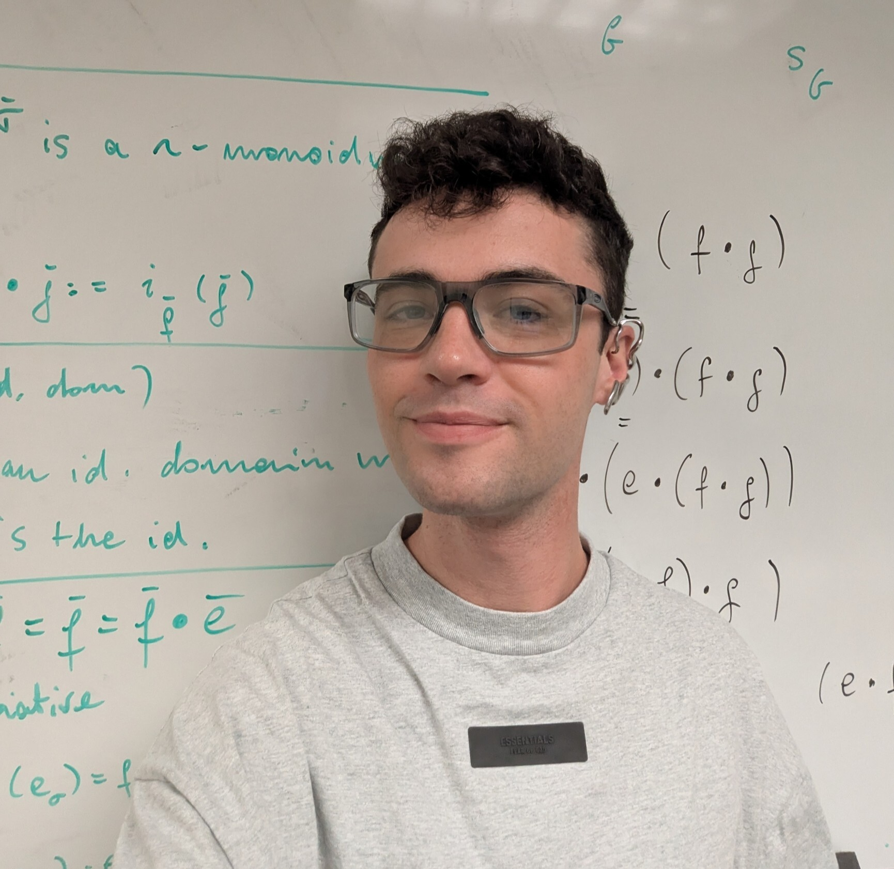

# Bio

I'm a philosophy Ph.D. candidate at the [University of Southern California](https://dornsife.usc.edu/phil/), where I am advised primarily by [Andrew Bacon](https://andrew-bacon.github.io/). I mainly work  on topics in philosophical logic and metaphysics. My broader philosophical interests include epistemology, ethics, PPE, early analytic philosophy, and the philosophy of mathematics.  

Before USC, I was a masters student in mathematical logic at the [Institute for Logic, Language and Computation (ILLC)](https://www.illc.uva.nl/). My advisor was [Nick Bezhanishvili]([staff.fnwi.uva.nl/n.bezhanishvili/](https://staff.fnwi.uva.nl/n.bezhanishvili/)). 

Before the ILLC, I studied philosophy at the [University of St Andrews](https://www.st-andrews.ac.uk/philosophy/), and earlier still at the [University of Padua](https://www.fisppa.unipd.it/). 

I was born and raised in Udine, Italy. 

# Knowledge Base

This website contains a mini knowledge base of concepts, arguments and results related to my research. It's meant to be a resource for those who want to know more about what I do without having to read entire papers. I've also included some thoughts about teaching. 

You can browse this knowledge base by clicking on internal links (like [[Quantificationalism|this one]]) or using the interactive graph on the right side of the screen.

%%
I'm also active in mathematical logic. In recent work with [Nick Bezhanishvili](https://staff.fnwi.uva.nl/n.bezhanishvili/), we give a [[proof of the Blok-Esakia theorem via stable canonical rules|new proof of the Blok-Esakia theorem]], which states that the lattice of superintuitionistic logics is isomorphic to that of normal extensions of the modal logic $\mathtt{Grz}$. Our proof leverages the machinery of [[Stable canonical rule|stable canonical rules]] and can be readily generalized to prove analogous results in richer signatures. %%

  
  
